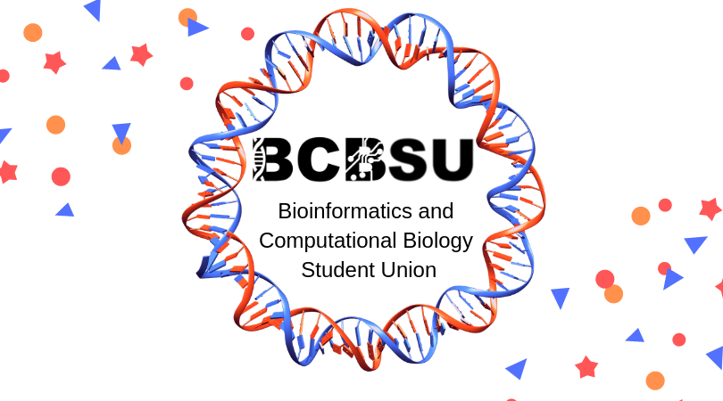

```{r, echo=FALSE, out.width = "70%", fig.align= "center"}
 
```


# Bioinformatics and Computational Biology Student Union 

Lorem ipsum dolor sit amet, cum id alii utroque, sea no nisl graeco persecuti. Nam et salutandi definitionem, sea vero postea constituam ad. Homero putant torquatos nec id, quis choro dissentias in his, mea ex quaeque detraxit elaboraret. Exerci option feugait usu at, ad assum doming nominati nec. At falli scribentur cum.

Ex vis tation numquam, quodsi oportere ne sed. Odio exerci tritani est ei. Agam oportere ius cu. Oratio labitur officiis at sea, tractatos partiendo euripidis eum et, amet elit consequuntur ut mea. Partem corpora ea sea, te melius eruditi maiorum has, at eum tollit sanctus. Ei consul detraxit eum, illum docendi mediocritatem qui eu.

His solet discere dissentiunt et, pro nominati abhorreant reformidans eu, vis cu veri vidit. In autem voluptatibus pri, sea amet suas bonorum ex. Expetendis necessitatibus ei qui, omnis graeco omittantur no cum, et oratio disputando ius. Debet scripta sea ut.
